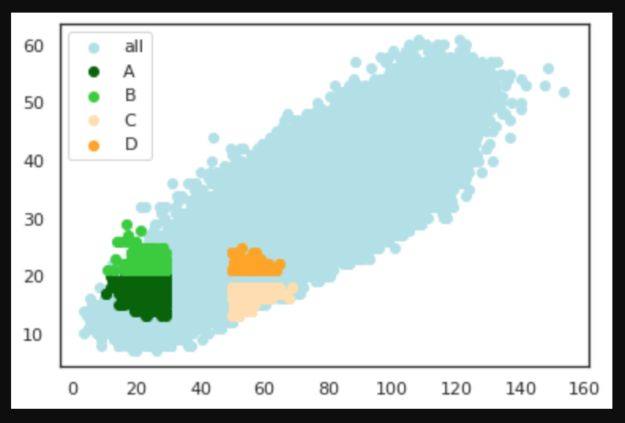

# letter_counting

Extract character/letters statistics from a list of words in Spanish (Or any other language)

## Purpose

We needed a quick way to check the statistics of `letter frequency` for spanish.

This notebook, also calculates a number of other variables, like 
    the lexic frequency, 
    phi (sum of relative frequency of each letter of a word), 
    rho (total strokes required to write a word)
    lenght (of the word)

and then extract words that we care about, like

## Usage

In this repository, you will find the code and the data used in this study.
The code is available in a "Jupyter Notebook", a friendly interface for readable code.

You can read a static copy of the notebook [here](https://github.com/juanantoniofm/letter_counting/blob/master/code/Letter%20Counting.ipynb)

If you want to run it yourself:

You will need some prerequisites on your machine (click on the links for more info)

- [Docker](https://docs.docker.com/docker-for-windows/)
- [Make](https://stackoverflow.com/questions/32127524/how-to-install-and-use-make-in-windows)

To use the command line

        make 

To start a local environment~

        make run

Once started the local environmen, click on the url on the output. Here is an example

    To access the notebook, open this file in a browser:
        file:///home/jovyan/.local/share/jupyter/runtime/nbserver-7-open.html
    Or copy and paste one of these URLs:
        http://023871f8100a:8888/?token=b716b9908f109c9b4922a8dcadb3bec5b1d2aacb7a8ccafd
     or http://127.0.0.1:8888/?token=b716b9908f109c9b4922a8dcadb3bec5b1d2aacb7a8ccafd

so in this case it will be: [ http://127.0.0.1:8888/?token=b716b9908f109c9b4922a8dcadb3bec5b1d2aacb7a8ccafd](http://127.0.0.1:8888/?token=b716b9908f109c9b4922a8dcadb3bec5b1d2aacb7a8ccafd)

## Instrucciones Simples para Windows

### Como ejecutar y modificar el Notebook

1.  Abrir Git Shell ( menu inicio, gitbash)
2.  Ir a la carpeta del projecto y ejecutar (run) el notebook

        cd workspace/letter_counting/
        winpty make run

3.  Abrir la URL en la ultima linea de la salida (del texto). Cuand haya terminado (normalmente unos pocos segundos)
    a.  http://127.0.0.1:8888/?token=2e321bccbbd47b7cb94f1878c206be05d0443934d1b56e3c

4.  En la URL veras un navegador de archivos. El notebook esta en “work/code/letterBLABLABLA”
5.  Abre el notebook, y ejecuta las celdas por orden.
    a.  No ejecutes las que pone DEBUG, TMP, SKIP (desarrollo, temporal y pasar)

### Como salvar cambios en el notebook online

Cuando guardas en el notebook, queda guardado en el sistema de archivvos local.
Para guardar a la nube y compartirlo, estando en la consola de git (gitbash) y desde la carpeta del projecto, ejecutar

        git commit -a -m “guardando cambios o algo asi”
        git push

Y esto subira los cambios a [github](github.com/juanantoniofm), en los archivos conocidos. 
Si has creado archivos nuevos y tambien los quieres agregar, ejecuta

        git add .
        git commit -m “guardando cambios o algo asi”
        git push

### Comprobar si hay cambios locales

Para verificar si tienes cambios locales, o si ves que te esta dando problemas a descargar (pull).

En un terminal de git, estando en la carpeta del repositorio. ejecuta

        git status
        
Y te mostrara los archivos cambiados.
### Descargar los archivos ultimos cambios de github

Para descargar los archivos, teniendo el repositorio clonado, tienes que iniciar el git_bash, ir a la carpeta con el repo, y "Tirar" los cambios hacia "abajo".

- En el menu de inicio, abre `git_bash` 

- En el shell de git, vete hacia la carpeta con el repo. (Recuerda usar `Tab` para autocompletar)

        `cd workspace/letter_counting` 
        
- ejecuta el comando de git para descargar los cambios. (Pull significa Tirar)

        `git pull` 

Y ya esta, ya tienes los cambios en tu maquina.

### Abrir archivos desde gitbash en Windows

Desde el shell de gitbash, en cualquier carpeta que estes, ejecuta

    explorer .

Ojo que el punto ese es importante. Esto abrira una ventana del navegador para que puedas manejar 
los archivos como quieras.

